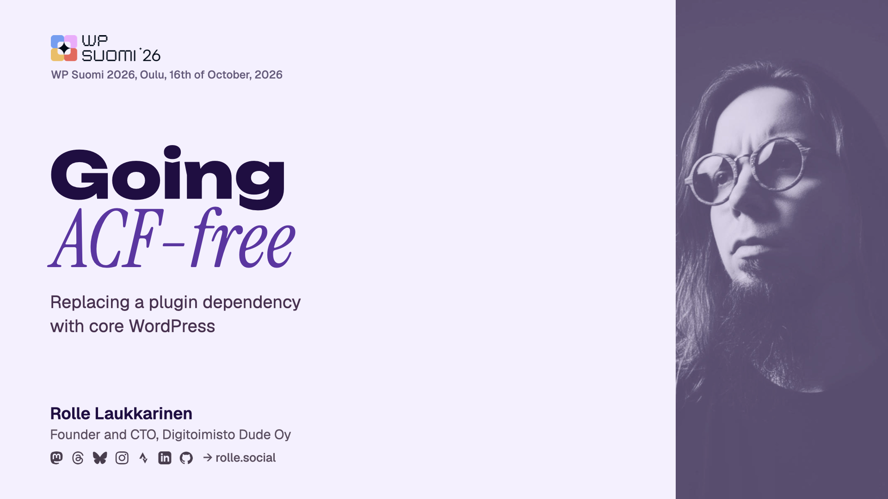

<h1 align="center">🧱 Going ACF-free</h1>

<p align="center">
  <strong>Replacing a plugin dependency with core WordPress. A talk for WP Suomi 2026.</strong>
</p>

<p align="center">
  
  
  
  
  
</p>

---



> [!IMPORTANT]  
> These slides are a work in progress and subject to change until the talk has been given.

## The talk

| | |
| -- | -- |
| Event | [WP Suomi 2026](https://wpsuomi.fi/), Hotel Lasaretti, Oulu |
| Slot | Thursday 16.10.2026, 14:10-14:55, main stage, 35 minutes plus Q&A |
| Complexity | Hard |
| Audience | Theme developers and agencies maintaining ACF-dependent WordPress sites |

Advanced Custom Fields has been a default in WordPress work for over a decade, to the point where a lot of sites cannot be maintained without it. Core has caught up considerably since then, particularly in how native Gutenberg blocks handle custom data and how blocks can be registered. Rolle goes through what core offers in place of the features developers lean on most, what changes in how you build once the plugin is gone, and where ACF is still the more sensible choice.

## Structure

| Path | What it is |
| -- | -- |
| `Going ACF-free.key` | The deck to present from, and the source of truth |
| `export/` | Exports for the organisers: `.pptx` for Google Slides and a `.pdf` |
| `keyassets/` | Everything placed on the slides: stamps, logos, GIFs, screenshots, code panels, diagrams and their HTML sources |
| `photos/` | Photos used on the About slide |
| `minutes.json` | Estimated minutes per slide, used by the footer timing bars |
| `tools/` | The AppleScript helpers that edit the open deck in Keynote |
| `talk.py` | The starting deck for [keynote-base](https://github.com/rollecode/keynote-base). Historical only |
| `speaker-notes.md`, `OUTLINE.md` | Early notes and the first outline |

## Working on the deck

The deck was generated once from [keynote-base](https://github.com/rollecode/keynote-base) and has been edited in Keynote since. Nothing rebuilds it. Changes go into the open `.key`, by hand or through `tools/newsection.py`.

Timing bars show where you should be by the clock. After moving slides, update `minutes.json` and run from the keynote-base root:

```bash
python3 scripts/refresh-progress.py talks/wpsuomi-2026 --minutes=minutes.json
```
